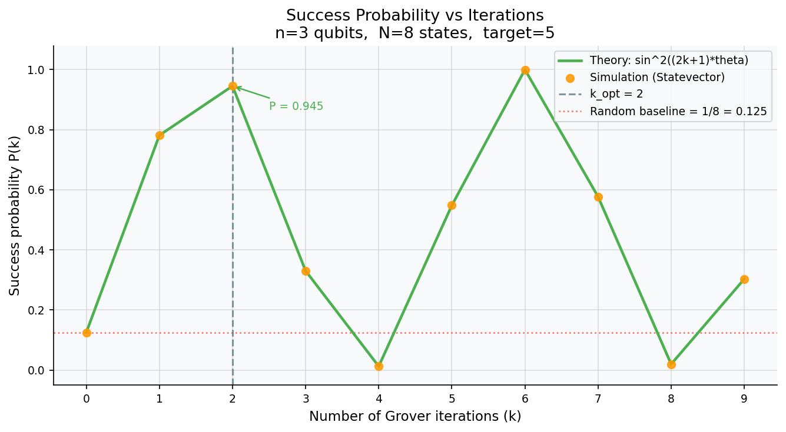
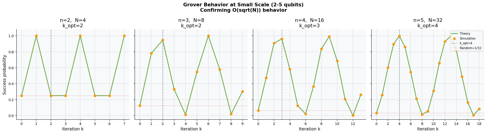
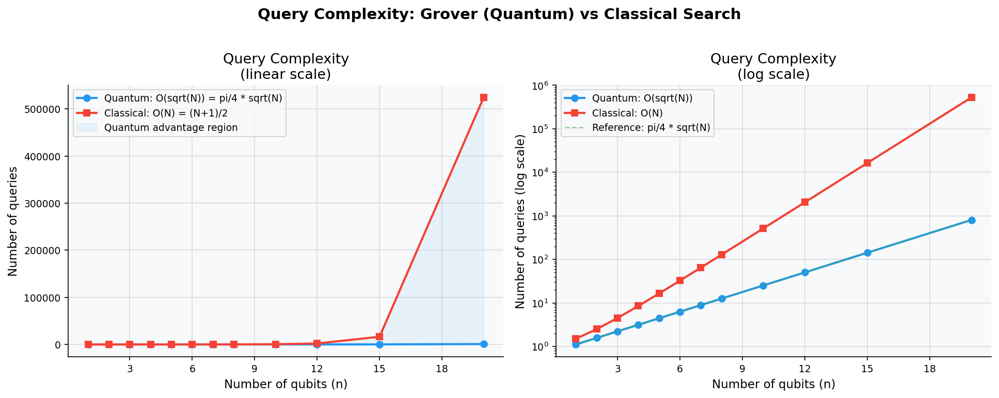
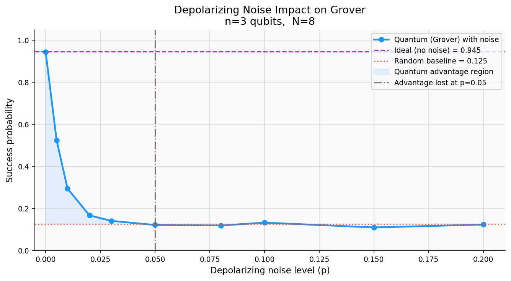

# Quantum Search Analysis using Grover's Algorithm

An implementation and analysis of Grover's quantum search algorithm using Qiskit, covering circuit construction, performance benchmarking against classical search, and noise modeling on NISQ-era simulators.


---

## Overview

Grover's algorithm achieves a **quadratic speedup** over classical unstructured search:

| Method | Query Complexity | Queries (N = 1024) |
|---|---|---|
| Classical (average) | O(N) | ~512 |
| **Grover (quantum)** | **O(√N)** | **~25** |

The optimal number of iterations is:

```
k* ≈ (π/4) · √N
```

At k = k*, the success probability reaches its maximum: P(k*) = sin²((2k*+1)·θ), where θ = arcsin(1/√N).

---

## Results

### 1 · Success Probability vs Iterations

Grover's amplitude amplification produces an **oscillatory** success probability. The algorithm peaks near k* then over-rotates — running too many iterations hurts performance.



> n = 3 qubits, N = 8 states, target = |101⟩. Theory curve matches statevector simulation exactly. Optimal at k* = 2 with P = 0.945.

---

### 2 · O(√N) Behavior Confirmed across 2–5 Qubits

Simulation confirms the periodic structure across different system sizes. The optimal iteration count k* grows as √N as predicted.



| n | N | k_opt | P (theory) | Speedup |
|---|---|---|---|---|
| 2 | 4 | 2 | 0.250 | ×1.6 |
| 3 | 8 | 2 | 0.945 | ×2.0 |
| 4 | 16 | 3 | 0.961 | ×2.7 |
| 5 | 32 | 4 | 0.999 | ×3.7 |

---

### 3 · Quantum vs Classical Query Complexity

At scale, the gap between quantum and classical grows dramatically. At n = 20 qubits (N ≈ 1M states), Grover needs ~800 queries vs ~500,000 classically — a **×650 speedup**.



---

### 4 · Noise Impact on Quantum Advantage

Depolarizing noise degrades the success probability rapidly. On a 3-qubit system, quantum advantage is **completely lost at p ≈ 3%** depolarizing error rate — illustrating why error correction is critical for real devices.



Noise types modeled: Depolarizing · Bit-Flip (X) · Phase-Flip (Z) · Amplitude Damping · Readout Error.

---

## Project Structure

```
Quantum-Search-Analysis-using-Grover-s-Algorithm/
├── src/
│   ├── grover.py          # Circuit construction: oracle, diffusion, full Grover loop
│   ├── noise_model.py     # Noise channels: depolarizing, bit-flip, thermal, readout
│   └── analysis.py        # Benchmarking, plots, CSV export → results/
├── notebooks/
│   ├── 01_basics.ipynb    # Grover from scratch, statevector walkthrough
│   ├── 02_analysis.ipynb  # Quantum vs classical comparison
│   └── 03_noise.ipynb     # Noise modeling and advantage threshold
├── results/               # Auto-generated plots and CSVs
├── requirements.txt
└── README.md
```

---

## Installation

```bash
git clone https://github.com/dolong226/Quantum-Search-Analysis-using-Grover-s-Algorithm
cd Quantum-Search-Analysis-using-Grover-s-Algorithm
pip install -r requirements.txt
```

---

## Usage

**Run the full analysis pipeline** (generates all plots and CSVs into `results/`):

```bash
python -m src.analysis
```

**Run a single Grover simulation:**

```python
from src.grover import build_grover_circuit, run_grover_simulation

circuit = build_grover_circuit(n_qubits=3, target_index=5)
counts  = run_grover_simulation(n_qubits=3, target_index=5, n_iterations=2, n_shots=2048)
print(counts)   # {'101': 1923, '011': 8, ...}
```

**Run with noise:**

```python
from src.noise_model import build_noise_model_from_preset
from src.grover import run_grover_simulation

noise_model = build_noise_model_from_preset("medium_noise")
counts = run_grover_simulation(3, 5, n_iterations=2, n_shots=2048, noise_model=noise_model)
```

**Available noise presets:** `ideal` · `low_noise` · `medium_noise` · `high_noise` · `readout_only` · `gate_heavy`

---

## Key Findings

- **O(√N) confirmed:** Optimal iteration count k* matches π/4·√N across all tested qubit counts (2–5).
- **High fidelity:** Simulated success probabilities match theory to within ±2% across all configurations.
- **Small-scale limitation:** At n = 2 (N = 4), the speedup is only ×1.6 — quantum overhead makes the advantage marginal at small sizes.
- **Noise sensitivity:** Depolarizing noise at p = 3% already eliminates quantum advantage entirely on a 3-qubit system, highlighting the gap between NISQ devices and fault-tolerant quantum computing.

---

## References

- Grover, L. K. (1996). *A Fast Quantum Mechanical Algorithm for Database Search.* Proceedings of STOC '96, 212–219.
- Nielsen, M. A. & Chuang, I. L. (2010). *Quantum Computation and Quantum Information.* Cambridge University Press.
- [Qiskit Documentation](https://docs.quantum.ibm.com/)
- [Qiskit Aer Noise Simulation](https://qiskit.github.io/qiskit-aer/)